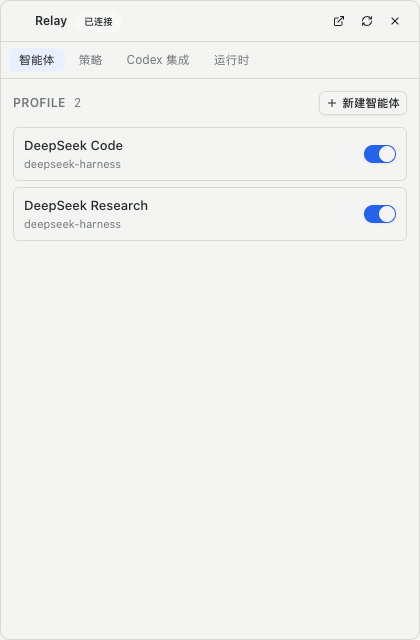

# Codex Integration

Relay 通过 **Codex 插件市场（plugin marketplace）+ MCP server** 接入 Codex。集成是一条完整生命周期，而不是一次性的复制安装。实现见 `apps/relayd/src/environment.ts`。



## 1. 安装了什么

| 组件 | 是什么 | 装在哪 |
|---|---|---|
| **MCP server** | `relay` stdio server：list/run/status/wait/send/cancel/accept/resume + sync/end session | Codex `config.toml` 的 `[mcp_servers.relay]` |
| **Plugin** | `relay@relay`：skill + hooks + 元数据 | `~/.relay/codex-plugin`（Relay 生成的本地 marketplace） |
| **Skill** | `skills/relay/SKILL.md`，教 Codex 把上下文压成 bounded task | 随插件 |
| **Hooks** | `hooks/hooks.json`：SessionStart → `sync_session`，SessionEnd → `end_session` | 随插件（首次使用需在 Codex 中信任） |

开发态 MCP 入口是 `corepack pnpm --dir <repo> mcp:dev`；构建产物态是 `node <out>/mcp/stdio.js`。daemon 记住它期望的入口，配置对不上就报 **stale**，而不是含糊地报"已配置"。

## 2. 五道检查（检测）

```text
✓ Codex detected        codex CLI 或 VS Code 扩展自带的副本
✓ Relay MCP             入口与期望一致，且入口文件存在
✓ Relay Skill           内容与当前 Relay 版本一致
✓ Relay Plugin          marketplace 已注册、插件 installed + enabled
✓ Relay Hooks           hooks.json 存在且与当前版本一致
```

每项都有 `status`（`ok / missing / stale / outdated / legacy`）与 `hint`，所以"不 ok"能区分：没装、指向旧路径、版本落后，还是手工复制的残留。

## 3. 动作

| 动作 | 行为 |
|---|---|
| **安装** | 生成插件树 → `codex plugin marketplace add` → `codex plugin add relay@relay` → `codex mcp add relay -- <entry>` → 清理旧版手工复制的 skill |
| **修复** | 与安装同一路径（强制重写插件与 MCP 入口），用于 stale / legacy |
| **更新** | 重新生成插件（版本 = skill + hooks 内容哈希）并重装，让 Codex 用上新版本 |
| **从 Codex 移除** | `codex plugin remove` → `codex plugin marketplace remove` → `codex mcp remove` → 删除 `~/.relay/codex-plugin` 与旧 skill 副本 |

移除是完整撤销：不会出现"Relay 已删除但 Codex 里还留着 MCP/skill/hooks"。

## 4. Session 生命周期

- `SessionStart` hook → `sync_session` → 用 Codex 提供的 thread id 调本地 Codex app-server 的 `thread/read`，取**真实的** thread 名称与 cwd 注册 HostSession（Relay 从不自造会话名）。
- `sync_session` 在任何 MCP 工具调用时也会兜底执行，所以即使 hooks 还没被信任，第一次委派也会把会话登记进来。
- `SessionEnd` hook → `end_session` → 会话标记 ended 并清理 session 级 policy。
- Codex CLI 不在 PATH 上时（VS Code 扩展安装的常态），解析器依次尝试已知位置，而不是直接失败。

## 5. 配置生效方式

Codex 侧的 MCP 进程是长驻的，所以配置变更不需要重启 Codex：

- `list_agents` 与 `run_agent` 之前都会重新读 `profiles.json`，把差异同步进 ProfileRegistry（新增/更新/删除）。
- policy 在每次 run 前按 workspace 重新解析。
- daemon 写配置 → MCP 下一次调用即生效；Web/菜单栏通过 SSE 收到新投影。

## 6. 目录

```text
integrations/codex/            仓库里的源
├── plugin.json                插件元数据（安装时转换为 .codex-plugin/plugin.json）
├── hooks/hooks.json           SessionStart / SessionEnd → mcp_tool
└── skills/relay/SKILL.md      Codex 读的 skill

~/.relay/codex-plugin/         安装时生成的本地 marketplace
├── .agents/plugins/marketplace.json
└── plugins/relay/
    ├── .codex-plugin/plugin.json
    ├── hooks/hooks.json
    └── skills/relay/SKILL.md
```
