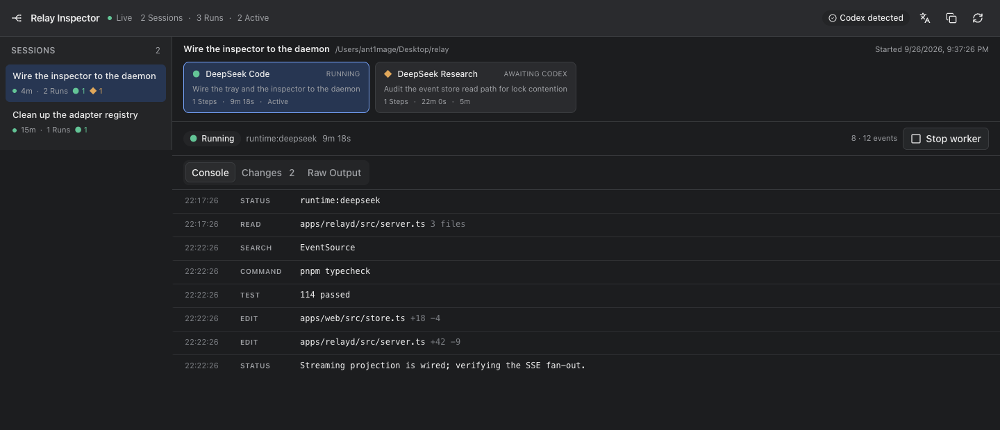

# Relay Inspector 与 relayd

日志不再画在一个应用窗口里。**relayd** 是常驻的本地日志服务，**Web Inspector** 是它托管的浏览器页面，**menu-bar** 只是那个页面的遥控器。三者都是 TypeScript。



## 1. 进程与数据流

```text
relay-mcp（Codex 启动的 stdio 进程，唯一的执行者）
  └─ RelayEvent（append-only）→ ~/.relay/relay.sqlite
                                     │
                       relayd 只读投影 │ 写控制队列（取消）
                                     ▼
              relayd  127.0.0.1:7352  ── /api/*（JSON）+ /api/stream（SSE）+ 静态页面
                                     ▲                       ▲
                          HTTP 轮询  │                       │ 打开 Edge/Chrome
                                     │                       │
                          menu-bar（Tray）              Web Inspector
```

关键分工：

| 进程 | 拥有什么 | 不做什么 |
|---|---|---|
| `relay-mcp` | RunController、policy、事件写入、worker 进程 | 不渲染界面 |
| `relayd` | 只读 projection、SSE、控制队列写入、静态托管、诊断 | 不启动/重试 worker，不解释原厂 stdout |
| `menu-bar` | 托盘菜单、打开浏览器、启动/重启 daemon | 不直接打开数据库，不推导状态 |
| `web` | 展示日志、取消、复制诊断 | 不写入事件日志 |

因为 daemon 与托盘都不持有执行状态，**它们可以随时重启**：正在跑的委派不受影响，页面重连后从事件日志补齐。

## 2. 端口与地址

| 端口 | 用途 |
|---|---|
| **7352** | relayd 默认端口：HTTP API、SSE、Web Inspector（RELA 的九宫格键位，IANA 未注册） |
| 7353+ | 被占用时自动顺延，最多尝试 PORT_ATTEMPTS 个 |
| **7354** | 仅开发态：Vite dev server，把 /api 反代到 daemon |

端口不写在调用方里：daemon 启动后把实际地址写进 `~/.relay/server.json`，托盘与脚本读这个文件，所以顺延不会让调用方指错地方。

```json
{ "pid": 17966, "port": 7352, "url": "http://127.0.0.1:7352", "token": "…", "database": "…" }
```

同一份 `server.json` 也是"是否已有 daemon"的判据：**已有存活 daemon 时再启动会直接退出 0**，所以托盘上的"启动日志服务"可以放心连点。

## 3. 事件传输

- 页面先用 `GET /api/snapshot` 拿全量投影（sessions / runs / steps / workers + runtimes / profiles / codex 检查）。
- 再连 `GET /api/stream`（SSE）：连接时收到 `hello` 加一份 `snapshot`，之后是增量。
- 某个 Run 的历史日志按需拉取：`GET /api/runs/:id/events?after=<seq>`，只拉当前正在看的那条。
- 服务端每 400ms 比对一次变更戳（`PRAGMA data_version` 与 `MAX(rowid)`），有变化才推；每个连接记着 per-run 的 seq 游标，只发新事件。
- 客户端按 `seq` 去重合并，所以"先连流、后补历史"不会重复也不会丢。

## 4. 安全边界

daemon 是本机服务，仍然按不可信输入对待：

1. 只绑定 `127.0.0.1`，不监听外网接口。
2. **Host 校验**：Host 必须是 `127.0.0.1:<port>` 或 `localhost:<port>`，防 DNS rebinding（公网域名解析到回环）。
3. **Origin 校验**：带 Origin 的请求必须同源，防其它站点用你的浏览器读日志。
4. **Token**：`/api/*` 需要每次启动生成的随机 token（`Authorization: Bearer` 或 `?token=`）。托盘从 `server.json` 读，浏览器从 URL 片段读一次后存 localStorage 并把片段从地址栏清掉。
5. 静态资源与 API 都不缓存（`cache-control: no-store`）。

## 5. API 一览

| 方法 | 路径 | 说明 |
|---|---|---|
| GET | `/api/health` | pid、端口、数据库、会话/运行计数 |
| GET | `/api/snapshot` | 全量投影（含 runtime/profile/Codex 检查） |
| GET | `/api/menu` | 托盘用的精简投影（活跃 worker、状态行） |
| GET | `/api/runs/:id/events?after=` | 某个 Run 的事件增量 |
| GET | `/api/stream` | SSE：hello / snapshot / events |
| POST | `/api/workers/:id/cancel` | 写一条取消命令到控制队列 |
| POST | `/api/sessions/:id/cancel` | 取消该会话所有活跃 worker |
| POST | `/api/codex/install` | 安装 Relay skill 与 MCP 配置 |
| POST | `/api/refresh` | 重新检测本机 runtime |
| GET | `/api/diagnostics` | 纯文本诊断报告（复制诊断信息用） |
| GET | `/*` | Web Inspector 静态资源（SPA 回退到 index.html） |

契约定义在 `packages/relay-api`（zod schema 与 `RelayClient`），daemon、托盘、Web 共用同一份，客户端会校验服务端返回。

## 6. Web Inspector

- 左栏是 Codex 会话（HostSession），名字与 Codex 一致。
- 中间是 Run 卡片条：状态、profile、任务、步数、耗时。
- 下面是 Console：只展示可观察动作（Read / Search / Edit / Command / Test / Result / Error / Status），连续三个以上的 Read/Search 折叠成一行；隐藏推理与 Runtime 内部 child agent 的规则不变。
- Changes 页按文件聚合增删行数；Raw Output 页是事件 JSON（尾部 400 条）。
- URL 即状态：`/s/<session>` 与 `/s/<session>/r/<run>`。托盘点会话就是打开这个地址，浏览器前进后退也照常工作。
- 顶部：连接状态（Live / 连接中 / 已断开）、会话与运行计数、Codex 安装状态、语言切换（en / zh-CN）、复制诊断、刷新。
- 主题跟随系统 `prefers-color-scheme`，没有独立主题开关。

## 7. 开发与验证

```bash
pnpm seed:demo                                            # 造演示事件日志 output/demo/relay.sqlite
RELAY_DB_PATH=$PWD/output/demo/relay.sqlite pnpm relayd    # 起服务，打印带 token 的地址
pnpm web:dev                                              # 改前端：Vite 7354，/api 反代到 7352
pnpm menubar:dev                                          # 改托盘
```

`RELAY_HOME` 可以把 `~/.relay` 整体换到别处（演示与测试都用它，避免动真实数据）：

```bash
RELAY_HOME=/tmp/relay-demo RELAY_DB_PATH=/tmp/relay-demo/relay.sqlite pnpm relayd
```

其他环境变量：RELAY_PORT（默认 7352）、RELAY_WEB_ROOT（静态资源目录）、RELAY_TOKEN（固定 token，仅测试用）、RELAY_BROWSER（托盘用哪个浏览器）。

## 8. 边界

- **不新增执行能力**：页面能取消，但不能发起、重试或改路由——那些是 Codex 与 policy 的事。
- **不做多用户/远程访问**：只绑回环，没有账号体系。
- **不做历史归档**：事件日志就是历史，daemon 不复制一份。
- **不做实时日志文件尾随**：展示的是归一化事件，原厂 stdout 只作为 `nativeEvent` 保留在事件里。
