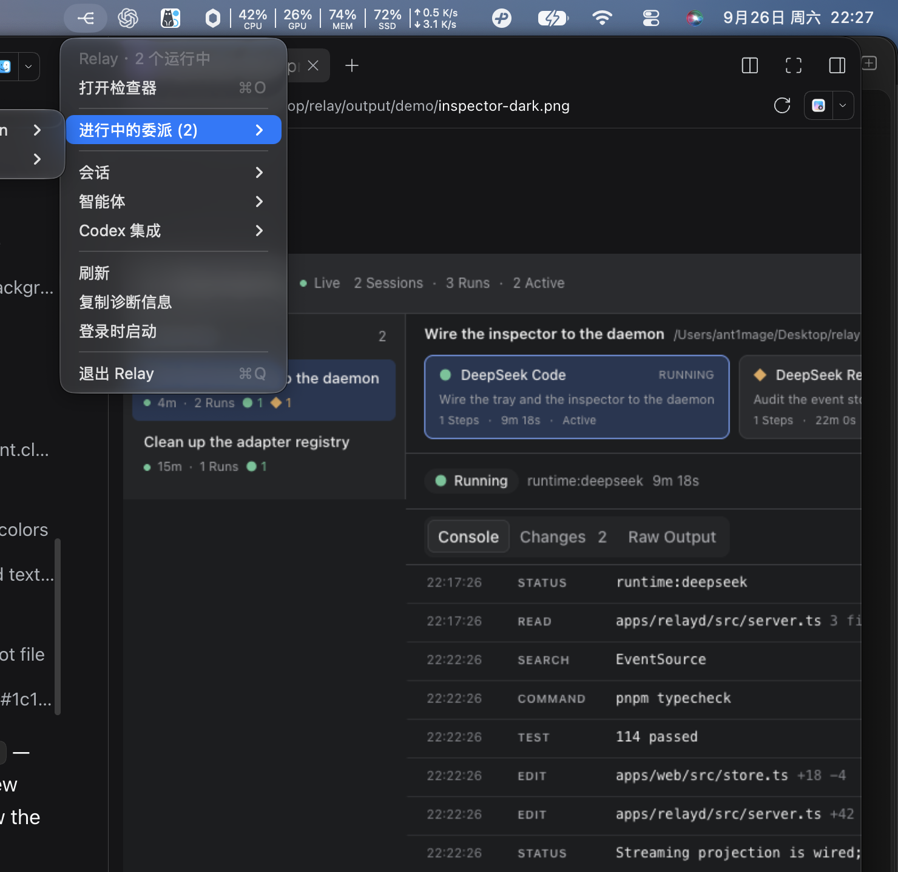
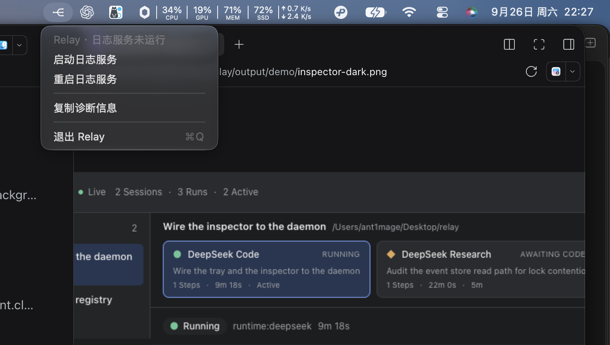

# macOS 菜单栏

Relay 的桌面存在感只有一个菜单栏图标：**没有窗口、没有 renderer、没有 HTML**。它是日志服务的遥控器——点某个会话就用 Edge/Chrome 打开对应的 Inspector URL（docs/inspector.md）。



## 1. 定位

```text
relayd（日志服务，127.0.0.1:7352）
   ▲                    ▲
   │ GET /api/menu      │ 打开 /s/<session>
   │                    │
menu-bar（Tray）      Edge / Chrome（Web Inspector）
```

托盘是**客户端**：读 `~/.relay/server.json` 找到 daemon，读 `/api/menu` 拿到投影，读不到就提供"启动日志服务"。它从不打开数据库、不推导状态、不决定委派给谁。

## 2. 菜单结构

```text
Relay · 2 个运行中                     ← 状态行 (disabled)
打开检查器                        ⌘O
──────────
进行中的委派 (2)                  ▸    ← 仅当有 worker 在跑
    会话名 — DeepSeek Code · 任务摘要 ▸
        在检查器中查看
        取消 worker
    (同一会话 ≥2 个 worker 时) 停止所有 worker · 会话名
──────────
会话                             ▸     ← 最近 8 条 Codex 会话
    会话名                      ▸
        在检查器中查看
        停止所有 worker          ← 无活跃 worker 时置灰
        打开工作区
        复制会话 ID
智能体                            ▸     ← Profile 列表即状态
    DeepSeek Code                     ← 可用：点开检查器
    Kimi Code · 需要认证               ← 置灰并给出原因
Codex 集成                        ▸
    已连接 / 未配置                    ← disabled
    ✓ 已检测到 Codex                   ← 三项真实检查
    ✗ 已配置 Relay MCP — <路径>         ← 失败项带路径
    安装到 Codex…
──────────
刷新
复制诊断信息
登录时启动                        ✓     ← macOS / Windows
──────────
退出 Relay                       ⌘Q
```

daemon 不可达时菜单换成自愈分支：

```text
Relay · 日志服务未运行
启动日志服务
重启日志服务
──────────
复制诊断信息
──────────
退出 Relay                       ⌘Q
```



折叠规则：活跃 worker 最多 12 条（超出折叠为 `+N`），会话最多 8 条，worker 标签里的任务截断到 48 字符。

## 3. 状态行

1. daemon 未运行 → `Relay · 日志服务未运行`
2. 正在启动 → `Relay · 正在启动日志服务…`（20 秒后仍不健康就回落为未运行）
3. 有 worker 在跑 → `Relay · N 个运行中`
4. 否则有 Run 在 `awaiting_host` → `Relay · N 个等待 Codex`
5. 否则 就绪 / 需要配置 / 未检测到 Runtime

## 4. 图标

复用 `assets/appicon/png/light/relay-icon-16.png`（叠加 32px 作为 @2x）并设置 `setTemplateImage(true)`：macOS 只用 alpha 通道，一个资源同时适配浅色与深色菜单栏。不新增 tray 专用资源，也没有图标构建脚本（assets/appicon/README.md 的约定不变）。

## 5. 行为

| 行为 | 说明 |
|---|---|
| 单击图标 | 打开菜单 |
| 双击图标 | 用默认浏览器打开检查器（最近会话） |
| 打开检查器 | 按顺序找 **Microsoft Edge → Google Chrome → Chromium → Brave**，都没有才用默认浏览器；可用 `RELAY_BROWSER` 指定 |
| 启动/重启日志服务 | `corepack pnpm --dir <repo> relayd`（打包后是随包的 daemon）；已有存活 daemon 时是空操作 |
| 取消 worker / 停止所有 worker | 走 `POST /api/workers/:id/cancel`，daemon 写控制队列，与页面上的取消同一条路径 |
| 复制诊断信息 | 取 `/api/diagnostics` 的纯文本放进剪贴板 |
| 登录时启动 | 直接读写系统 login items，Relay 不存副本 |
| 语言 | 跟随系统语言（`app.getLocale()`）；页面内有自己的语言切换 |
| Dock 图标 | 固定 `accessory` 激活策略：托盘应用不需要 Dock 图标与应用菜单 |
| 退出 | 只从菜单退出；没有窗口可以关 |

托盘每 2 秒轮询一次 `/api/menu`（daemon 侧对投影有缓存），序列化后的模型不变就不重建 NSMenu。

## 6. 明确不做

- **不做"暂停委派"总开关**：要停就 cancel（可审计），要改规则去 policy；菜单开关会绕开 scope 解析。
- **不做 Agents 启停**：Profile 决定 Codex 能发现什么，属于配置面；菜单只显示状态并作为入口。
- **不显示 child agent / 隐藏推理**：与 Console 相同。
- **不做通知与 badge**：现有资源只有纯标记，没有"标记 + 圆点"的模板图。

## 7. 实现结构

| 文件 | 职责 |
|---|---|
| `src/menu-model.ts` | 纯函数：`MenuBarView` → `MenuBarItem[]`，不 import Electron，可单测 |
| `src/main.ts` | Electron 侧：Tray 图标、模型转 NSMenu、2s 轮询、动作派发 |
| `src/daemon.ts` | server.json 发现、健康探测、启动/停止 daemon、浏览器选择与打开 |
| `src/app-icon.ts` | 模板图路径（开发态与打包态） |

打包时 Electron 只是外壳：`esbuild` 把 `src/main.ts` 打成单个 ESM 文件，`electron .` 运行它。

## 8. 验证

- 单测：`apps/menu-bar/test/menu-model.test.ts` 覆盖状态行优先级、daemon 分支、活跃 worker、置灰原因、上限折叠、中英标签。
- 冒烟（真实 NSMenu + 真实数据）：

  ```bash
  pnpm seed:demo /tmp/relay-demo/relay.sqlite
  RELAY_HOME=/tmp/relay-demo RELAY_DB_PATH=/tmp/relay-demo/relay.sqlite pnpm relayd &
  env -u ELECTRON_RUN_AS_NODE RELAY_HOME=/tmp/relay-demo \
    RELAY_MENU_BAR_PREVIEW=1 RELAY_MENU_BAR_PREVIEW_DELAY_MS=5000 \
    pnpm --filter @relay/menu-bar start
  ```

  `RELAY_MENU_BAR_PREVIEW` 只在未打包构建里生效，用于截图与人工检查（上面的图就是这么来的）。
  注意：在设置了 `ELECTRON_RUN_AS_NODE=1` 的环境（例如 DSH 的 shell）里必须用 `env -u` 清掉，否则 Electron 会以纯 Node 启动并报 `does not provide an export named 'BrowserWindow'`。

## 9. 后续

1. `awaiting_host` 视觉提示：需要一张"标记 + 圆点"的模板图。
2. 菜单打开时即时刷新：目前靠 2s 轮询，必要时改成 `tray.on('mouse-down')` 触发一次强制刷新。
3. 打包：`LSUIElement`、随包 daemon、开机自启与通知权限都取决于打包配置，仓库目前还没有打包配置。
4. Windows / Linux 托盘图标（非模板语义）与关闭行为的差异需要单独验证。
